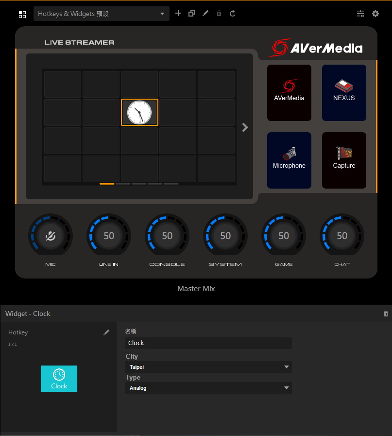

 
 

    

 
 

# Contents
- [English](#Description)
- [繁體中文](#描述)

# **Description**
This is a plug-in that can display clock faces; you can choose the city time zone and even switch between a digital or an analog clock face.

# **Features**
* Code in Qt Creator
* Drop-down menu to select the city time you want and change the clock type (digital or analog)
* Tap the screen to change the clock type

# **Development Environment**
Comptabile to Win OS 10 / Mac OS 11.4  and above
Developed with Qt 5.13.2

# **Overview**
There are three main roles in this application.
1. Creator Central
2. Widget(Controller)
3. Property
This application demo shows how to implement a clock widget using Qt.

When Creator Central starts Widget (Controller), Creator Central will send two parameters to Widget (Controller), namely Widget UUID and port. The two communicate through WebSocket. The follow-up commands need to include the Widget UUID information for identification, and the relevant definitions such as the packet format are explained in [The Overview of Creator Central SDK](https://github.com/AVerMedia-Technologies-Inc/CreatorCentralSDK).
The clock is created using Qt, and the content drawn on View is converted into a picture, and then converted into a Base64 String and sent to Creator Central.

Adjust the time zone and clock type.
|  key   | value  |
|  ----  | ----  |
| city  | Taipei / New_York / California |
| type  | analog / digital |

The current demo provides three cities and two clock types to choose from. You can modify the time zone or clock type by using Property, and then send the parameters to Widget (Controller). Widget (Controller) draws a new screen based on the received parameters.
It is displayed in Creator Central, and at the same time, the configuration file of Creator Central is also updated to ensure that it will be in the last operation state when the application is opened next time.

You can see the complete [Time Zone List](https://en.wikipedia.org/wiki/List_of_tz_database_time_zones)

# **Application File Description**
|  File Name  |  Content Description
|  ----  | ----  |
| [Blank.png](https://github.com/AVerMedia-Technologies-Inc/WidgetCPPSample/blob/main/Sources/ClockWidget_CPlusPlus/Resource/Blank.png)  | Background image for digital clock |
| [ClockJPG.jpg](https://github.com/AVerMedia-Technologies-Inc/WidgetCPPSample/blob/main/Sources/ClockWidget_CPlusPlus/Resource/ClockJPG.jpg)  | Background image for analog clock |
| [WebClientDemo.cpp](https://github.com/AVerMedia-Technologies-Inc/WidgetCPPSample/blob/main/Sources/ClockWidget_CPlusPlus/WebClientDemo.cpp)  | main flow program and main form |
| [Websocket2Client.cpp](https://github.com/AVerMedia-Technologies-Inc/WidgetCPPSample/blob/main/Sources/ClockWidget_CPlusPlus/Websocket2Client.cpp)  | websocket connection class |

Note: Creator Central only supports String data type. If a Data type packet is sent, Creator Central will not take any action.

# **Installation**
Integrate the compiled executable file into the Widget directory (Clock_CPlusPlus.widget/)
* [WinOS]
Place the Widget directory to "C:/Users/＜YourName＞/AppData/Roaming/AVerMedia Creator Central/widgets/＜PackageName＞/", then open the Creator Central machine to see it.
* [MacOS]
Place the Widget directory to "~/Applications Support/AVerMedia Creator Central/widgets/＜PackageName＞/", then open the Creator Central machine to see it.

# **Uninstallation**
* [WinOS]
Close Creator Central, and go to "C:/Users/＜YourName＞/AppData/Roaming/AVerMedia Creator Central/widgets/＜PackageName＞/", delete the Clock_CPlusPlus.widget folder, and then open Creator Central again.
* [MacOS]
Close Creator Central, and go to "~/Applications Support/AVerMedia Creator Central/widgets/＜PackageName＞/", delete the Clock_CPlusPlus.widget folder, and then open Creator Central again.

# **Troubleshooting for running failure**
* [WinOS]
1. Make sure the Widget directory is placed under folder "C:/Users/＜YourName＞/AppData/Roaming/AVerMedia Creator Central/widgets/＜PackageName＞/".
2. In the WidgetConfig.json file in the Widget directory, check whether the Win Target name is the name of the executable file: ClockWidget_CPlusPlus.exe.
* [MacOS]
1. Make sure the Widget directory is placed under folder "~/Applications Support/AVerMedia Creator Central/widgets/＜PackageName＞/".
2. In the WidgetConfig.json file in the Widget directory, check whether the Mac Target name is the name of the executable file: ClockWidget_CPlusPlus.app.

- - -

# **描述**
這是一個可以顯示時鐘的插件，你可以選擇想要的城市時區，甚至還可以變換數位時鐘或是類比時鐘

# **特徵**
* 用 Qt Creator 編寫程式碼
* 下拉式選單選擇你想要的城市時間及改變時鐘的類型（數位或是類比）
* 點擊螢幕即可更換時鐘類型

# **開發環境**
適用於 Win OS 10 / Mac OS 11.4 以上版本
使用 Qt 5.13.2 版本開發

# **整體概要說明**
整個應用主要有三個角色
1. Creator Central
2. Widget(Controller)
3. Property
而本範例程式展示的是使用 Qt 如何實作一個時鐘的 Widget

當 Creator Central 啟動 Widget（Controller） 時， Creator Central 會派發兩個參數給 Widget（Controller） ，分別是 Widget UUID 以及 port。兩者間透過 WebSocket 進行溝通。後續的指令溝通都需要包含 Widget UUID 這資訊用以識別，封包格式等相關定義在 [The Overview of Creator Central SDK](https://github.com/AVerMedia-Technologies-Inc/CreatorCentralSDK) 有更進一步的說明。

時鐘的製作主要是使用 Qt 繪製，將繪製在 View 上的內容轉換成圖片，接著再轉換成 Base64 String 傳送至 Creator Central 。

調整時區和時鐘的類型
|  key   | value  |
|  ----  | ----  |
| city  | taipei / new_york / california |
| type  | analog / digital |

目前範例程式中提供了三個城市和兩種時鐘類型做選擇。
透過操作 Property 修改時區或時鐘的類型，然後將參數傳送至 Widget（Controller）。 Widget（Controller） 根據收到的參數繪製新的畫面在 Creator Central 顯示出來。與此同時也一併更新 Creator Central 的設定檔，確保下次開啟應用程式時，會是上次最後的操作記錄。

在這個網址可以看到所有的 [時區列表](https://en.wikipedia.org/wiki/List_of_tz_database_time_zones)

# **程式檔案說明**
|  檔案名稱  | 內容描述  |
|  ----  | ----  |
| [Blank.png](https://github.com/AVerMedia-Technologies-Inc/WidgetCPPSample/blob/main/Sources/ClockWidget_CPlusPlus/Resource/Blank.png)  | Background image for digital clock |
| [ClockJPG.jpg](https://github.com/AVerMedia-Technologies-Inc/WidgetCPPSample/blob/main/Sources/ClockWidget_CPlusPlus/Resource/ClockJPG.jpg)  | Background image for analog clock |
| [WebClientDemo.cpp](https://github.com/AVerMedia-Technologies-Inc/WidgetCPPSample/blob/main/Sources/ClockWidget_CPlusPlus/WebClientDemo.cpp)  | main flow program and main form |
| [Websocket2Client.cpp](https://github.com/AVerMedia-Technologies-Inc/WidgetCPPSample/blob/main/Sources/ClockWidget_CPlusPlus/Websocket2Client.cpp)  | websocket connection class |

注意：Creator Central 只支援 String 資料型別. 如果發送 Data 資料型別的封包的話， Creator Central 將不會有任何動作。

# **安裝**
將編譯後執行檔整合進 Widget 目錄 （Clock_CPlusPlus.widget/)
* [WinOS]
將 Widget 目錄放置到 "C:/Users/＜YourName＞/AppData/Roaming/AVerMedia Creator Central/widgets/＜PackageName＞/" ，接著打開 Creator Central 機器即可看到。
* [MacOS]
將 Widget 目錄放置到 "~/Applications Support/AVerMedia Creator Central/widgets/＜PackageName＞/" ，接著打開 Creator Central 機器即可看到。

# **反安裝**
* [WinOS]
關掉 Creator Central ，到 "C:/Users/＜YourName＞/AppData/Roaming/AVerMedia Creator Central/widgets/＜PackageName＞/" 目錄下把 Clock_CPlusPlus.widget 資料夾刪掉，再次打開 Creator Central 即可。
* [MacOS]
關掉 Creator Central ，到 "~/Applications Support/AVerMedia Creator Central/widgets/＜PackageName＞/" 目錄下把 Clock_CPlusPlus.widget 資料夾刪掉，再次打開 Creator Central 即可。

# **無法執行時的問題排除措施說明**
* [WinOS]
1. 確認 Widget 目錄是否有確實放置到 "C:/Users/＜YourName＞/AppData/Roaming/AVerMedia Creator Central/widgets/＜PackageName＞/" 資料夾之下
2. 檢查 Widget 目錄裡的 WidgetConfig.json 檔案中， Win 的 Target 名稱是否是執行檔的名稱 （ClockWidget_CPlusPlus.exe）
* [MacOS]
1. 確認 Widget 目錄是否有確實放置到 ~/Applications Support/AVerMedia Creator Central/widgets/＜PackageName＞/ 資料夾之下
2. 檢查 Widget 目錄裡的 WidgetConfig.json 檔案中， Mac 的 Target 名稱是否是執行檔的名稱 （ClockWidget_CPlusPlus.app）
